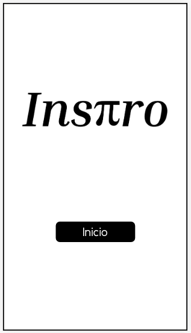
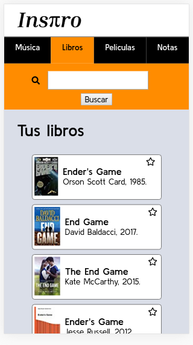

## Fase 1

### 1. Requisitos

#### Descripción

En esta primera fase voy a crear la **estructura** de ficheros y una **maquetación básica para móvil** necesaria para acceder a las diferentes secciones ( música, libros, películas y notas).

Investigaré las **tres APIs** de las que se servirá la aplicación (Goodreads, Spotify y OMDB) para conocer los detalles de cada petición y asegurarme que será posible obtener la información que quiero.

En esta fase me centraré en la sección de **libros** y en la siguiente adaptaré los componentes creados para conseguir resultados similares en las otras secciones.

Primero mostraré un listado de libros guardados por el usuario, con la posibilidad de marcar **favoritos**, añadir **comentarios** y mostrar el **detalle** de un elemento. La información se obtendrá en el inicio de un archivo creado por mí en formato JSON, para después ser obtenida por medio del fetch a la API.

La información relativa al uso de la aplicación se **guardará** en la memoria **local** para que esté disponible cuando ese mismo usuario vuelva a la web utilizando el mismo terminal.

#### Requisitos técnicos

Voy a necesitar:

- Maquetación teniendo en cuenta la vista móvil.
- Usar React Router para conectar las diferentes secciones de mi SPA
- Un fetch para coger los datos de un servidor fake.
- Estructura de componenetes con React que pueda reutilizar en otras secciones.

### 2. Prototipo

### 3. Planificación

Tareas de la fase 1:
https://github.com/users/mariaglomana/projects/1

### 4. Feedback y valoración

Para saber si he cumplido mi objetivo voy a:

- realizar test
- mostrar la aplicación a usuarios sin explicar antes su funcionamiento para que me den su opinión acerca de la usabilidad
- hacer una retro el día fijado como límite de la primera fase, haciendo un balance por escrito de los objetivos fijados y el resultado final alcanzado.
